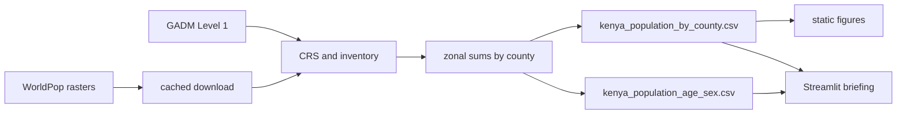
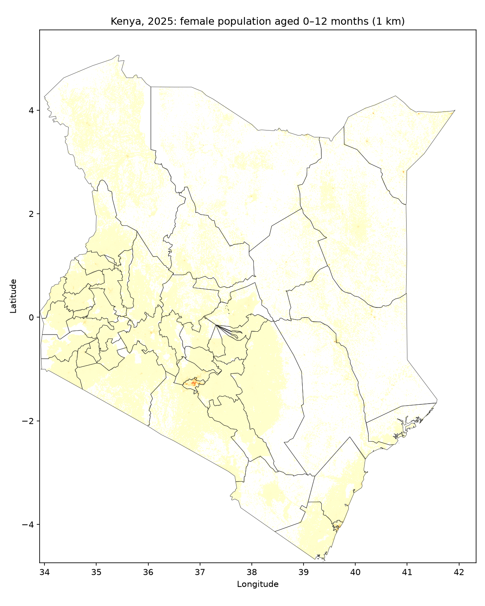
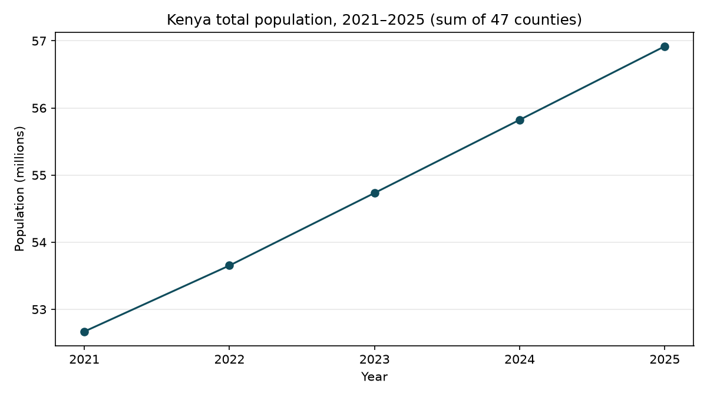
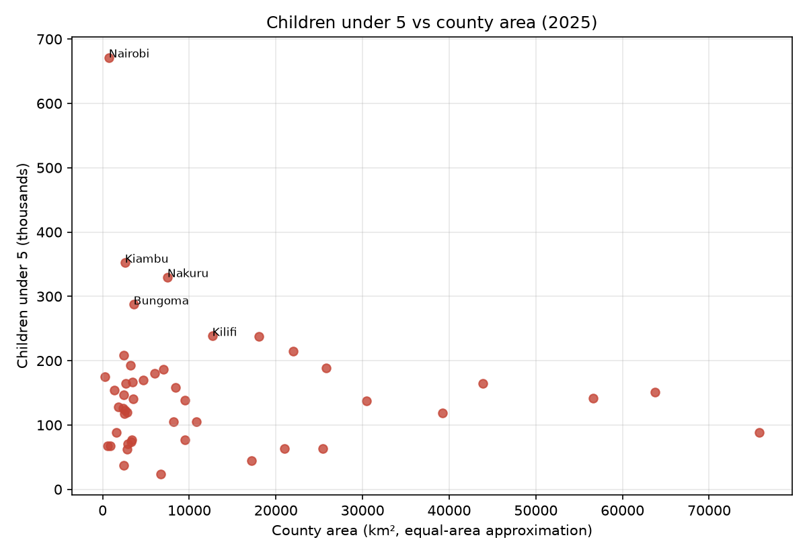

# County age structure · Kenya

A briefing tool for Ministry of Health planning: who lives in each of Kenya’s 47 counties, and who will need clinics. WorldPop 1 km age–sex estimates for 2021–2025 are aggregated to counties, then explored on a Streamlit map, pyramid, and table.

Children under 5 need immunization and nutrition. People 65+ need chronic and geriatric care. Child dependency (under 5 per 100 people aged 15–64) is a simple read of how much clinic demand sits on the working-age base.

The original assignment text is in [`docs/assessment-brief.md`](docs/assessment-brief.md). How AI was used is in [`AI_DISCLOSURE.txt`](AI_DISCLOSURE.txt).

## How the work is put together



The brief links GADM Level 2 and asks for 47 counties. Level 2 is 300 sub-county units. Aggregation uses **Level 1 `NAME_1`**. That decision is in `data/processed/validation_log.txt`.

CSV rows keep GADM spelling (`HomaBay`). The dashboard shows ordinary names (`Homa Bay`).

## Setup

Python 3.12 (geospatial wheels on 3.14 are unreliable).

```powershell
git clone https://github.com/Nosh-thee-techy/AHADI_DS_Assessment.git
cd AHADI_DS_Assessment
python -m venv .venv
.\.venv\Scripts\Activate.ps1
pip install -r requirements.txt
```

Conda alternative: `conda env create -f environment.yml`.

Raw rasters are not in git. The pipeline downloads them into `data/raw/` and skips files already on disk.

## Run the pipeline

```powershell
python -m src.pipeline
```

`--download-only` stops after fetching WorldPop and GADM. `--skip-download` uses the cache.

Writes:

| Path | What |
| --- | --- |
| `data/processed/kenya_population_by_county.csv` | County × year indicators (GADM names) |
| `data/processed/kenya_population_age_sex.csv` | Age–sex counts for the pyramid |
| `data/processed/kenya_counties_simplified.geojson` | Map geometry |
| `data/processed/validation_log.txt` | Files processed, CRS, missing-file and quality decisions |
| `outputs/figures/` | The three static pictures below |

```powershell
python -m unittest discover -s tests -v
```

## Pictures from the pipeline

2025 female population aged 0–12 months (immunization cohort), 1 km:



National total, 2021–2025 (sum of 47 counties):



Children under 5 against county area. Nairobi is small and crowded; a large dry county is the opposite:



## Dashboard

Hosted: [https://ahadi-test.streamlit.app](https://ahadi-test.streamlit.app)

```powershell
streamlit run dashboard/app.py
```

Opens at [http://localhost:8501](http://localhost:8501). Year, sex, map metric, county, and compare-with all change the view. Click a county to pin it. Hover for people, under 5, 65+, and dependency. After the pyramid, three cards say what the age mix means for clinics.

Language, theme, year, map, and county sit in the left column.

Download CSV from the same panel. The file keeps both GADM and display names.

## Assumptions

- These are modelled WorldPop estimates, not the census.
- Under 5 = WorldPop codes `00` + `01`. Working age = 15–64. Elderly = 65+.
- Sex ratio is males per 100 females.
- County area is a rough equal-area figure from the GADM polygons, used for children per km².
- 2021–2025 growth is similar in every county in this product, so it is not mapped as a story.

## Layout

```
src/                 pipeline (download, validate, aggregate, figures)
dashboard/           Streamlit app, charts, briefing copy, CSS
data/processed/      CSVs, geojson, validation log
outputs/figures/     static pictures required by the brief
tests/               validation, aggregation, dashboard
docs/assessment-brief.md
AI_DISCLOSURE.txt
```
